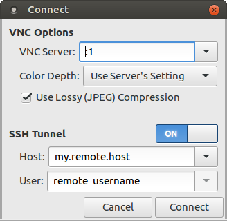
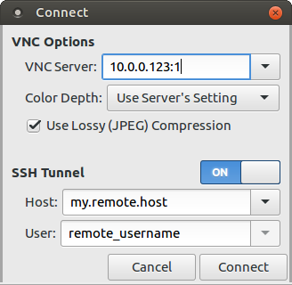

# gsshvnc - A simple VNC client with built-in SSH tunneling

gsshvnc (pronounced "Gosh VNC") is designed to make your otherwise-insecure
unencrypted VNC connections secure by making it as simple as possible to
establish an SSH tunnel for the connection.

It is based on the excellent [gtk-vnc](https://wiki.gnome.org/Projects/gtk-vnc)
project that powers [Vinagre](https://wiki.gnome.org/Apps/Vinagre), but unlike
Vinagre uses [libssh](https://www.libssh.org/) directly, making it easier to
port to Windows and other systems.  It is actively supported on Linux and
Windows, but should work on other platforms supported by GTK+ 3.0.

## How to Connect with an SSH tunnel

For the simplest case, enable the SSH tunnel via the switch on the connection
dialog, and enter the remote host's address or domain name, and your username
for the remote host (if different from your current username).  To specify a
different desktop on the remote host, enter ":&lt;display&gt;" into the
"VNC Server" field:

You can also tunnel through an SSH host to a computer on a network that would
otherwise be inaccessible by specifying the remote host in the "VNC Server",
for example:

When connecting, gsshvnc will try your SSH public keys first, and prompt for
an SSH password if that fails.  After establishing a tunnel, your VNC server
may prompt for a second password (for your VNC desktop).

Note that gsshvnc can also be used as a "plain" VNC client without any SSH
tunnel by simply turning off the SSH tunnel switch.
